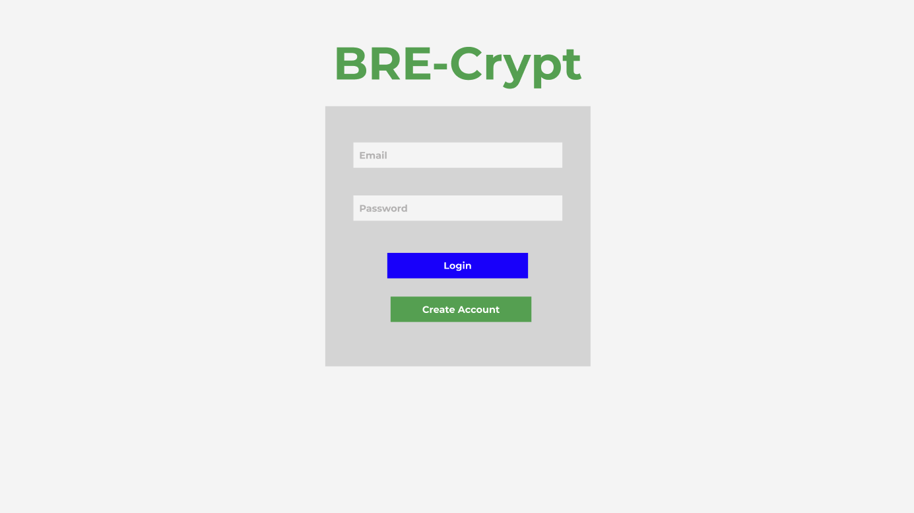
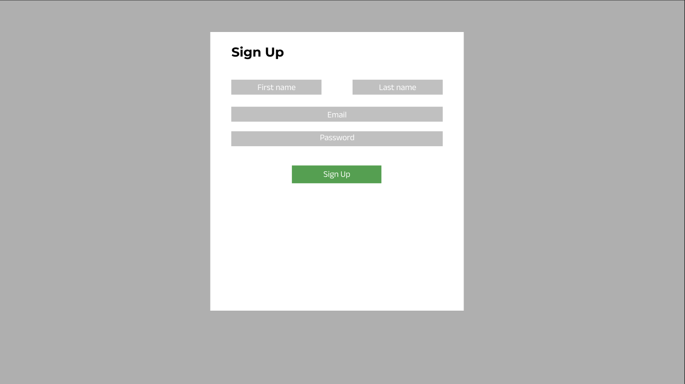
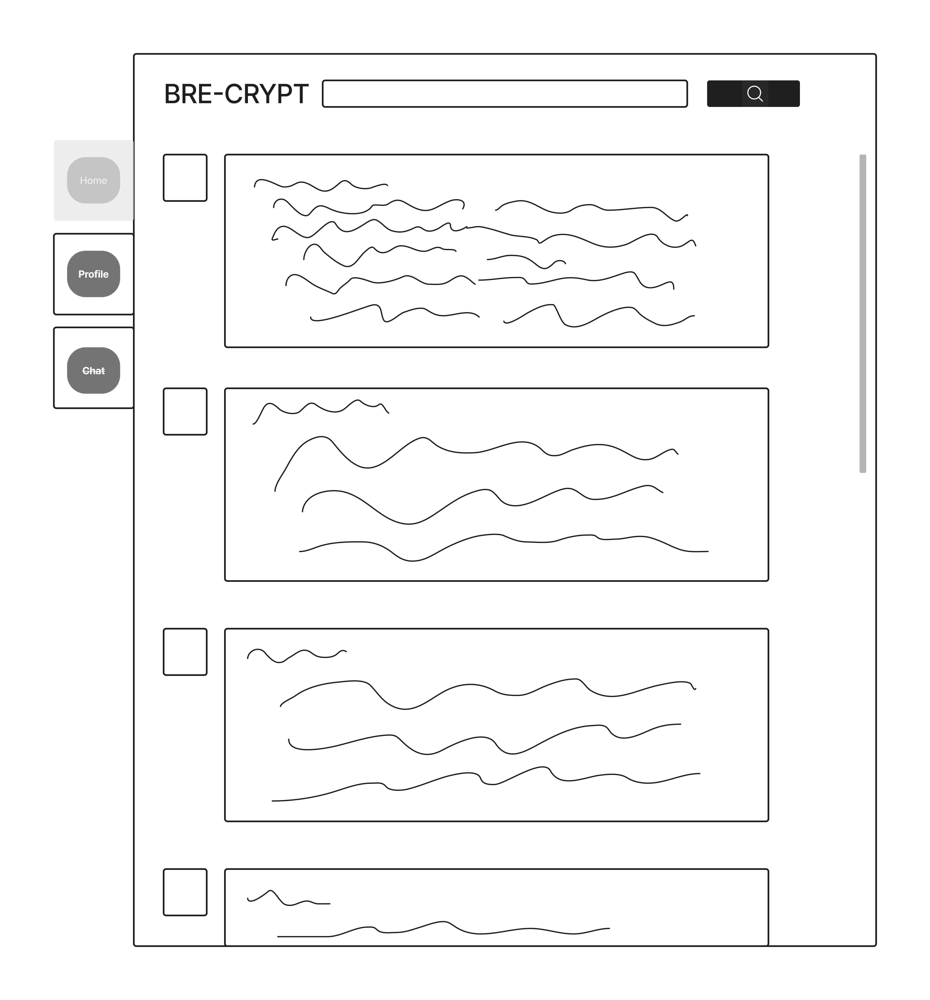
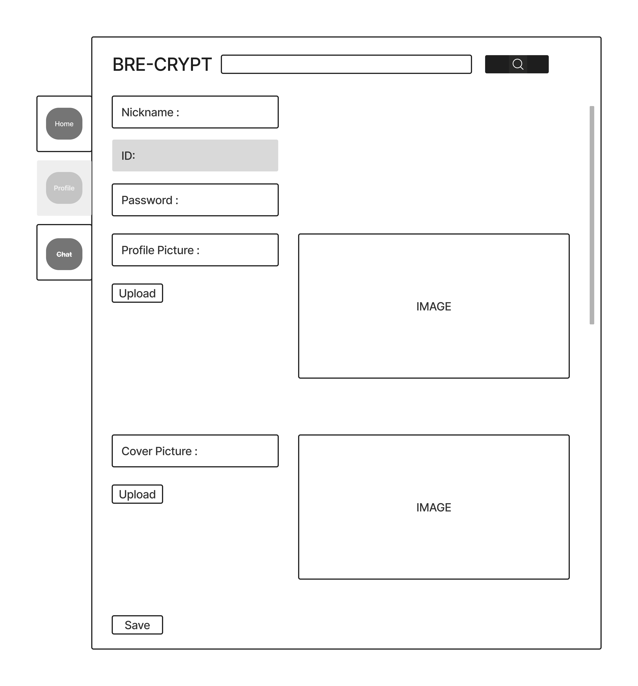
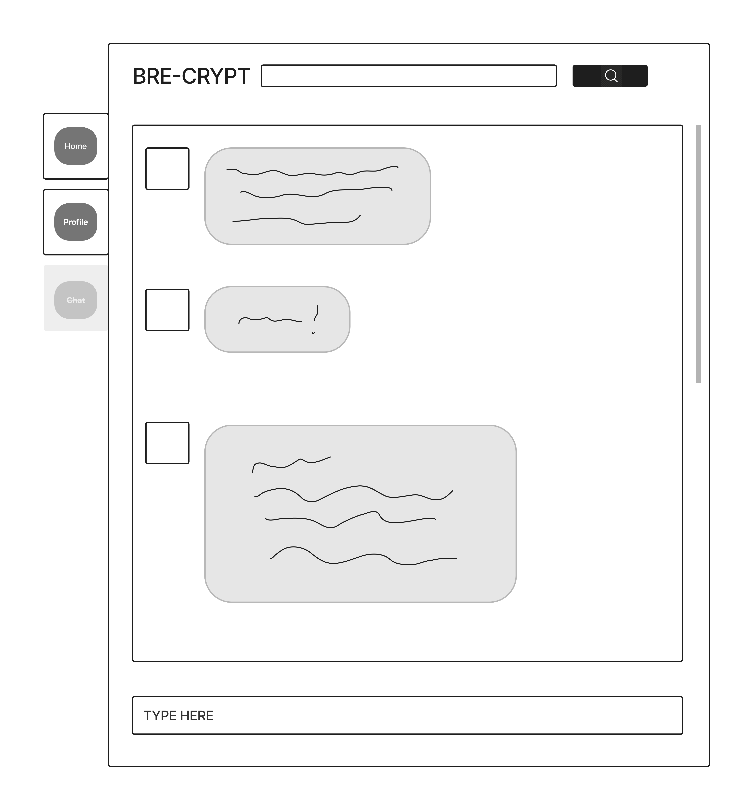

<<<<<<< HEAD
# SOCIAL MEDIA APP
BRE-Crypt
By; Rita, Enoch, and Bruce
=======
 
# SOCIAL MEDIA APP

## DEVELOPER DETAILS
- This is a Social Media Application
-  CREATED BY BRE-Crypt ===> Rita, Enoch, and Bruce
>>>>>>> ad1f0e8bdf93bbeaf6ccf93610e08e341b3a5502

# User Story
Welcome to the GenZ era of Social Media. 
Our Social media app facilitates users to do the following on our website:->

- Sign-Up
- Log-In
- Log-Out
- Show Online or Offline

- Create Post/Content
- Update/Delete Content
- Follow
- Unfollow

BONUS

- Comments on Profile Picture
- Chat-Bot

# Technologies Used

1. HTML5
2. CSS
3. Java Script
4. Node and it's packages
5. Mongoose/MongoDB
6. Express
7. React


<<<<<<< HEAD
1) Website Landing Screen
Login
  - Initial landing page will prompt a retuning user to Log-In or Sign Up

Sign Up
  - If a user is new to the platform, they have the ability to log in.


2) Home Screen
Main Page of Social Media App
  - User can see posts and make searches

User Page: 
  - Upload profile images, password, and nicknames

Direct Message Feature


# Models - ERD

=======

# ENTITY RELATIONSHIP CHART


# ROUTES

### User Routes
| **URL**            | **HTTP Verb**|**Action**     |
|--------------------|--------------|---------------|
| /             | GET          | All Users          |
| /sign-up      | GET          | new                |
| /sign-up      | POST         | create             |
| /sign-in      | GET          | login              |
| /sign-in      | POST         | create             |
| /sign-out     | DELETE       | destroy            |
| /update       | UPDATE       | Update info        |


# Models 
>>>>>>> ad1f0e8bdf93bbeaf6ccf93610e08e341b3a5502
1. User Schema

```.js

const userSchema = new mongoose.Schema(
  {
    profilePicture: {
      type: String,
      data: Buffer
    },
    coverPicture: {
        type: String,
        data: Buffer
    },
    followers: {
        type: Array,
        default: []
    },
    followings: {
        type: Array,
        default: []
    },
        username: { 
      type: String, 
      required: true, 
      unique: true 
    },
        email: {
      type: String, 
      required: true 
    },
    password: {
        type: String
    },
    description: {
        type: String
    },
    city: {
        type: String
    },
    active: {
        type: Boolean
    }

  }, {
      timestamps: true,
      toObject: { virtuals: true },
      toJSON: { virtuals: true }
  }
)
```


2. Content Schema

```.js

const contentSchema = new mongoose.Schema(
  {
    owner: {
      type: Schema.Types.ObjectId,
      ref: 'User',
      required: true
    }, 
    img: {
      type: String,
      data: Buffer,
    }, 
    material: {
      type: String
    },
    likes: {
      type: Array,
      default: []
    }

  }, {timestamps: true}
)
<<<<<<< HEAD

```.js
=======
```


>>>>>>> ad1f0e8bdf93bbeaf6ccf93610e08e341b3a5502
