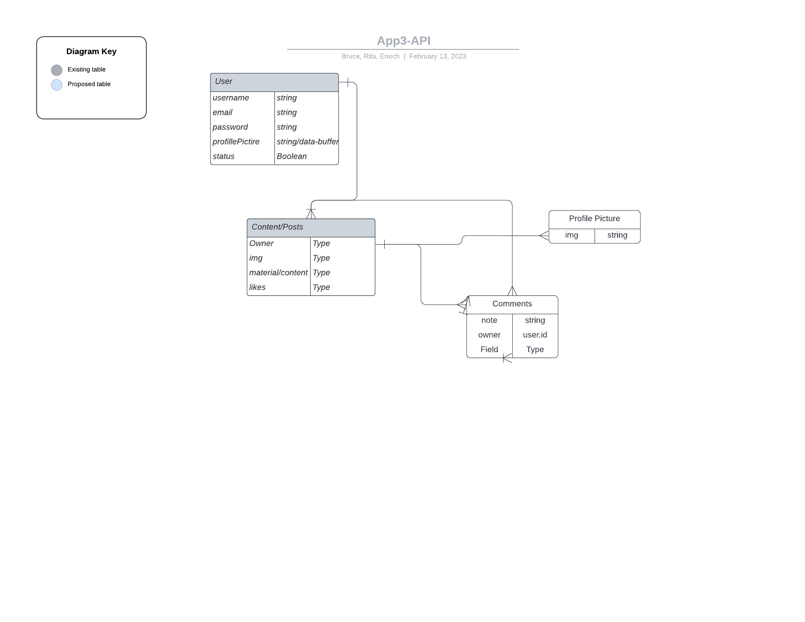

 
# SOCIAL MEDIA APP

## DEVELOPER DETAILS
- This is a Social Media Application
-  CREATED BY BRE-Crypt ===> Rita, Enoch, and Bruce

# User Story
Welcome to the GenZ era of Social Media. 
Our Social media app facilitates users to do the following on our website:-

- Sign-Up
- Log-In
- Log-Out
- Show Online or Offline

- Create Post/Content
- Update/Delete Content
- Follow
- Unfollow

BONUS

- Comments on Profile Picture
- Chat-Bot

# Technologies Used

1. HTML5
2. CSS
3. Java Script
4. Node and it's packages
5. Mongoose/MongoDB
6. Express
7. React


# ENTITY RELATIONSHIP CHART



# ROUTES

### User Routes
| **URL**            | **HTTP Verb**|**Action**     |
|--------------------|--------------|---------------|
| /sign-up      | GET          | new                |
| /sign-up      | POST         | create             |
| /sign-in      | GET          | login              |
| /sign-in      | POST         | create             |
| /sign-out     | DELETE       | destroy            |
| /update       | UPDATE       | Update info        |


# Models 
1. User Schema

```.js

const userSchema = new mongoose.Schema(
  {
    profilePicture: {
      type: String,
      data: Buffer
    },
    coverPicture: {
        type: String,
        data: Buffer
    },
    followers: [
        {type: Schema.Types.ObjectId,
        ref: 'User'} 
    ],
    followings: [
        {type: Schema.Types.ObjectId,
        ref: 'User'} 
    ],
    username: { 
      type: String, 
      required: true, 
      unique: true 
    },
    email: {
      type: String, 
      required: true 
    },
    password: {
        type: String
    },
    description: {
        type: String
    },
    city: {
        type: String
    },
    active: {
        type: Boolean
    }

  }, {
      timestamps: true,
      toObject: { virtuals: true },
      toJSON: { virtuals: true }
  }
)
```


2. Content Schema

```.js

const contentSchema = new mongoose.Schema(
  {
    owner: {
      type: Schema.Types.ObjectId,
      ref: 'User',
      required: true
    }, 
    img: {
      type: String,
      data: Buffer,
    }, 
    material: {
      type: String
    },
    likes: [
      {type: Schema.Types.ObjectId,
      ref: 'User'} 
    ],

  }, {
      timestamps: true,
      toObject: { virtuals: true },
      toJSON: { virtuals: true }
  }
)

```

3. Comment Schema

```.js
const commentSchema = new mongoose.Schema(
  {
    owner: {
      type: Schema.Types.ObjectId,
      ref: 'User',
      required: true
    },
    usercomment: {
        type: String,
        required: true
    }
  }
)
```


